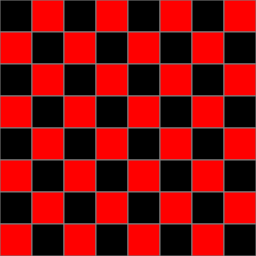
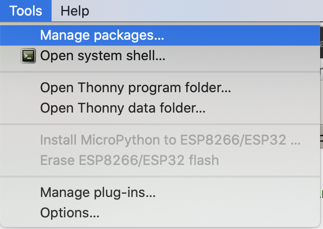
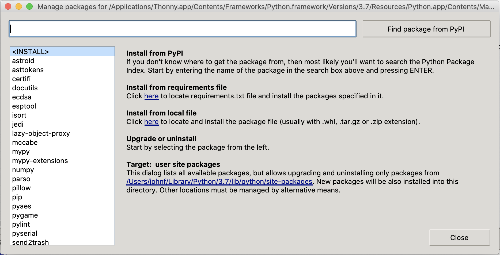
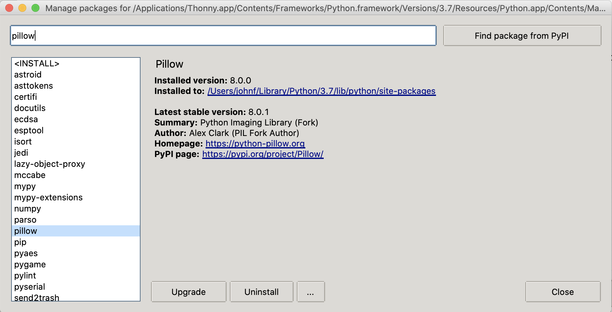

# Files and Data

This set of notes is intended to provide some background on what files really are (and how to use them) in Python.

## Writing to a file (Basic)

We can write the numbers 1..100 to a file as follows:

```python
# create a variable to hold our open file
numbers_out = open('numbers.txt', 'w')
# print our data to the file.
for i in range(100):
    print(i+1, file=numbers_out)
# remember to close it.
numbers_out.close()
```

 - Notice that ``open`` takes two arguments - the name of the file to create, and a string ``'w'`` -- this indicates that we want to write to the new file we're creating. In the next section, we'll use ``'r'`` to read from the file instead.
 - I called the variable holding the file ``numbers_out``; ``out`` to remind me we're writing to it; and ``numbers`` because it tells me what's going in there. In examples where you only have one file, sometimes you see shorter names, like just ``out``, or ``f`` for file.
 - Make sure you understand why we're using ``i+1`` here.

### Do we need to call ``close``?

In order to write to files very quickly, your computer is lazy -- it keeps track of the things you've asked it to save, but it doesn't always ***actually do it*** until you let them know you're done, by closing the file.

Therefore, if you don't ``f.close()`` your file ``f``, it might be empty, or partially written. If you've encountered a file that doesn't open before, you might have said this file was ***corrupted***.


## Writing to a file (Better)

Since I always forget to ``close`` my files, I only ever ``open`` files in a ``with`` statement. You should, too!

```python
# Replacing: 
#   numbers_out = open('numbers.txt', 'w')
#   numbers_out.close()
with open('numbers.txt', 'w') as numbers_out:
    for i in range(100):
        print(i+1, file=numbers_out)
```
 
 The ``with`` is a new statement construct, like a function declaration or an if-statement or a for-loop. ``with`` closes our files upon exiting the block.

```python
with open('numbers.txt', 'w') as numbers_out:
    for i in range(100):
        print(i+1, file=numbers_out)
    # numbers_out still open here.
# numbers_out closed here.
```

Just like the variable ``i`` is only really useful inside the for-loop, the variable ``numbers_out`` that has our file is only useful inside the ``with`` statement block.

### Printing to a file (and string.format)

It turns out that the ``print`` function has a keyword argument, ``file`` that allows us to print to a file instead of to Thonny's console. This is typically how I work with files.

We can also use the ``write`` function, but it's a little bit harder to work with -- we need to give it a string, (unlike ``print``) and so I'm introducing ``format`` here to convert our numbers to a string, and include a newline (``"\n"``) which ``print`` does by default.

```python
with open('numbers.txt', 'w') as numbers_out:
    for i in range(100):
        numbers_out.write("{}\n".format(i+1))
```

We could have also called something like ``numbers_out.write(str(i+1)+"\n")`` but ``format`` is both more convenient, more flexible, and hopefully -- more readable.

## Reading from a file

Getting information from a file also requires that we first ``open`` a file. More importantly, it requires that we know what should be inside the file, and that we write some code to turn it from a string into what we want to use!

### Read a file to a string

Now that we've created our file ``"numbers.txt"``, we can open it with Thonny or another text editor, but we can also read it from Python. 

```python
with open('numbers.txt', 'r') as numbers_in:
    data = numbers_in.read()
print(data)
```

Note that you can call ``open`` directly, but here, too, it is most correct to use the ``with`` statement. You can also leave off the ``'r'`` argument, because that is the default ***mode*** with which we open files.

When you run this code, you'll see that the whole file has been read in as a string. We might instead want to turn it into a list of numbers; how we wrote it to the file.

#### String -> list of ints 

To convert a string with a number on each line to a list of integers, we could do something like this:

```python
numbers = []
for line in data.splitlines():
    numbers.append(int(line))
print(numbers)
```

Now we have the list of numbers ``1,2,3,..100`` that we wrote to the file. 

We still have the big string inside ``data``, which is not a great idea if we ever work with really big data (millions of lines). But, it turns out there's a solution: we read the file a line at a time.

### Reading one line at a time

It turns out that we frequently want to work with each line in a file, one at a time.

```python
# skipping the data variable

numbers = []
with open('numbers.txt', 'r') as numbers_in:
    # files in Python act like lists of lines in a for-loop:
    for line in numbers_in:
        numbers.append(int(line))
print(numbers)
```

We still end up with the same data in ``numbers`` but we collect it one line at a time, when the file ``numbers_in`` is still open.

## Data: It's all just numbers

Since we're going to be talking about how computers work very soon, and files can be read as either textual data or as binary data we should take a peek at what is inside a string, so we can understand how these are two views of the same thing!

### Strings, ASCII and Unicode

We're going to take a brief detour to talk about how strings actually work.

Strings are actually a sequence of numbers; we can access the number for each letter by using the ``ord`` function in Python. 

```python
>>> data = "hello 1 2 3"
>>> for ch in data:
...   print(ch, ord(ch))
... 
h 104
e 101
l 108
l 108
o 111
  32
1 49
  32
2 50
  32
3 51
```

The opposite of ``ord`` is ``chr``: ``chr(89)`` gives us the upper-case letter ``'Y'``.

It turns out that computers don't really understand text! They only understand numbers. By convention, we have decided that certain numbers correspond to certain letters: ``104`` is lowercase H, ``32`` is a blank space, ``49`` is the letter ``1``, etc. 

For many years, text data could not be shared well between languages: English-speaking users often used the [ASCII table](https://en.wikipedia.org/wiki/ASCII#/media/File:USASCII_code_chart.png), a mapping for the numbers from 0-127 to most keys on a US keyboard, with punctuation and spaces of various kinds included as well. In some other places, "extended ASCII" claimed the numbers from 128-255 and was used to represent additional letters with accents, and that covered a variety of European languages. But it turns out there were many different types of "extended ASCII", which meant that documents were not easily shared between different countries of the world, and ASCII couldn't even begin to represent written alphabets like [Hanzi](https://en.wikipedia.org/wiki/Chinese_characters) which has thousands and thousands of individual characters.

Modern computers typically use a version of [***Unicode***](https://home.unicode.org/) which represents most known written languages, including emoji (😲). Thonny is not great with Emoji and Unicode, but Python has been much better ever since Python 3... ***Unicode*** has space for over ``2**20`` (1,048,576) characters, and even as the Unicode Consortium adds more languages and letters and Emoji, there's still plenty of space! Very few fonts support all these letters, so sometimes you'll see a box character or a question-mark (□,�), meaning that that (a) computer understood your emoji or character, but doesn't know how to turn it into graphics, or (b) the computer did not understand your character!

When we ``print`` strings and data from files, it shows up interpreted as ASCII or Unicode, depending on your operating-system, font, and language settings. But your computer is only moving numbers from place to place! It has no idea that we're sharing paragraphs, sentences, words or letters in the first place.

### What's a Byte? What's Binary?

There's a reason that extended ASCII only used numbers 0-255; and that ASCII targets the numbers 0-127. The reason is that 256 and 128 are ***powers of two***.

It turns out that computers are built around the idea of on/off switches; with only on/off (``True``or ``False``) to select from, we can only express the number ``1`` or the number ``0``.

But here's a trick -- by combining multiple of these ``0``/``1`` switches, we can represent larger numbers on our computer. Think about writing numbers with arabic numerals: we only have 10 such numbers: ``0,1,2,3,4,5,6,7,8,9``, but we can represent many more numbers than just 10 by combining them.

The way you've learned to read and write numbers in arabic numerals is a ***base-10*** or decimal number system. There are 10 symbols, and so when we need to represent numbers larger than that, we must use more places.

<table class="docutils">
<thead>
<tr>
<th>1000s</th><th>100s</th><th>10s</th><th>1s</th>
</tr>
<tr>
<th>10**3</th><th>10**2</th><th>10**1</th><th>10**0</th>
</tr>
</thead>
<tbody>
<tr>
<td>0</td><td>4</td><td>5</td><td>7</td>
</tr>
</tbody>
</table>

The number 457 represents 4 in the hundreds-place, 5 in the tens-place, and 1 in the ones-place: ``4 * 100 + 5 * 10 + 7 * 1``

Binary numbers (or ***base-2*** numbers) are exactly the same concept. To represent that same number; 457, we must use a lot more places, since the only two symbols we have are 0 and 1 -- each place is worth less.

457 in binary is written as: 111001001

We still have a 1s place, but we also have a 2s place, a 4s place and so forth, growing by 2 every step, rather than grow by 10.

To understand this binary number, let's write out the places for each digit:

<table class="docutils">
<thead>
<tr>
<th>256</th><th>128</th><th>64</th><th>32</th><th>16</th><th>8</th><th>4</th><th>2</th><th>1</th>
</tr>
<tr>
<th>2**8</th><th>2**7</th><th>2**6</th><th>2**5</th><th>2**4</th><th>2**3</th><th>2**2</th><th>2**1</th><th>2**0</th>
</tr>
</thead>
<tbody>
<tr>
<td>1</td><td>1</td><td>1</td><td>0</td><td>0</td><td>1</td><td>0</td><td>0</td><td>1</td>
</tr>
</tbody>
</table>

So this number is: ``256 + 128 + 64 + 8 + 1``. Using these 9 switches, we can represent other numbers... any number from 0 to 511, in fact. 

Each of these switches is called a **bit**.

Computers don't operate at the bit-level; it's just too complicated and not very efficient: we always want somewhat bigger numbers than that! 

You probably have used only 32-bit or 64-bit computers -- the bit numbers here correspond to the largest size the computer is comfortable using (More on that soon!). However, the largest numbers a computer is comfortable with don't matter as much as the smallest numbers.

The smallest unit most computers operate over is a ***byte***, which is a grouping of 8 bits. Since a ***byte*** has 8 bits, it can represent ``2**8`` possibilities, the numbers from 0-255, or with a trick (we'll discuss two's complement next week), numbers from -128..127.

Because ***bytes*** are the smallest unit on a computer, this is why ASCII was designed to fit comfortably in a byte. Unicode (``2**20``) has more than 1-byte (``2**8``) worth of data, but less than 4 bytes (``2**32``), so there's actually 3 common ways to write it down: UTF-8, UTF-16, and UTF-32 (the number corresponds to the number of bits read at a time!). UTF-8 overlaps quite nicely with ASCII, and it is the default format in many new applications.

### ``bytes`` and Binary Files

When we talk about how everything is composed of bytes, and think about files as being composed of a sequence of bytes (that happen to be english text), we need another way to interact with files. That way is to open them as "binary" numbers, and to use the ``write`` method.

First, let's prepare our numbers!
```python
# Note that all these numbers are < 256; so they each fit in a byte!
data_nums = [84, 104, 105, 115, 32, 105, 115, 32, 109, 
             121, 32, 115, 101, 99, 114, 101, 116, 32, 109, 101, 
             115, 115, 97, 103, 101, 33, 10]
```

Let's write that data to a file!

```python
with open('message.secret', 'wb') as out:
    out.write(bytes(data_nums))
```

Since I specifically picked out ASCII data to write to our file, even though we've written a sequence of numbers, we can open and read it as if it were text:

```python
with open('message.secret') as msg:
    print(msg.read())
```

What is the secret message? Run the pieces you need for this now.

### Plain Text Files

***Plain-text files***, like this ``'message.secret'``, our Python code, and the files we've created so far are intelligible by a lot of different programs. If you're on MacOS, you can open these files you've created with TextEdit, and if you're on Windows, you can open these files with NotePad. ***Note, you will probably have to convince your computer to try by right-clicking and choosing Open With...***.

Other kinds of files, like Word Documents, images,  audio files, ZIP files, and anything else you might have seen are not likely to actually be ***"Plain-text"*** files. If you open them to print out with Python, you'll be in for a whole bunch of "nonsense" text.

### What are File Extensions?

We gave our file the extension ``".secret"`` which may confuse them, but file names and extensions are just like labels! You can't make a Python file into a JPEG image by renaming ``hw1.py`` to ``hw1.jpeg``, but you can confuse Windows/MacOS about which program it should open it with!

Think of file names as labels! You can write "banana" on a sticky note and put it on an apple as many times as you want, it won't turn yellow!

## Plain-Text Images: SVG


There's an image format called SVG (Scalable Vector Graphics) we can use to draw to a file. It is a lot like HTML, where special sequences are called "tags" and are marked with angle-brackets.

For example; the following snippet would instruct the program reading the file to draw a green rectangle at (11,22) with of size (33,44). 

```xml
<rect x="11" y="22" width="33" height="44" color="green">
```

An example that shows off many basic shapes is to the left; this comes from a [tutorial from Mozilla](https://developer.mozilla.org/en-US/docs/Web/SVG/Tutorial/Basic_Shapes).

Writing these files by hand can become tedious, but we can use Python to quickly "generate" a lot of shapes, and save it to an SVG file. [Inkscape](https://inkscape.org/about/screenshots/) is an example of drawing software that lets you compose SVG images visually.

For example, we can recreate our chessboard:



Which will have the rather repetitive body of:
```xml
<?xml version="1.0" standalone="no"?>
<svg width="256" height="256" version="1.1" xmlns="http://www.w3.org/2000/svg">
    <rect x="0" y="0" width="32" height="32" stroke="grey" fill="black" />
    <rect x="0" y="32" width="32" height="32" stroke="grey" fill="red" />
    <rect x="0" y="64" width="32" height="32" stroke="grey" fill="black" />
    <rect x="0" y="96" width="32" height="32" stroke="grey" fill="red" />
    <rect x="0" y="128" width="32" height="32" stroke="grey" fill="black" />
    <!-- ... xml comment here to mention skipped lines ... -->
    <rect x="224" y="224" width="32" height="32" stroke="grey" fill="black" />
</svg>
```

To save time, we could write a Python program to generate all these rectangle tags and save the output to a file with the extension ".svg" then we can view it in a compatible program.

To make your life easier, I suggest using single-quoted strings (since attributes are quoted in the SVG file we're trying to create), and I also recommend the ``format`` function again; here we will really demonstrate its usefulness; having a lot of ``"{}"`` get substituted for us is quite convenient.

```python
size = 32
with open('chessboard.svg', 'w') as out:
    print('<?xml version="1.0" standalone="no"?>', file=out)
    drawing = '<svg width="{}" height="{}" version="1.1" xmlns="http://www.w3.org/2000/svg">'.format(size*8, size*8)
    print(drawing, file=out)
    for x in range(8):
        for y in range(8):
            color = "red"
            if (x + y) % 2 == 0:
                color = "black"
            rect = '<rect x="{}" y="{}" width="{}" height="{}" stroke="grey" fill="{}" />'.format(x * size, y * size, size, size, color)
            print(rect, file=out)
    print("</svg>", file=out)
```

Running this code produces a file, ``"chessboard.svg"`` which can then be opened by another program on your computer (Chrome or Firefox should understand it, at least!)

### Abstraction

If we want to make our lives easier, we can separate the parts that put together the SVG XML from the parts that draw the chessboard:

```python
def svg_start(svg, width, height):
    print('<?xml version="1.0" standalone="no"?>', file=out)
    print('<svg width="{}" height="{}" version="1.1" xmlns="http://www.w3.org/2000/svg">'.format(width, height), file=svg)
    
def svg_end(svg):
    print('</svg>', file=svg)
    
def svg_rect(svg, x, y, width, height, color):
    print('<rect x="{}" y="{}" width="{}" height="{}" stroke="grey" fill="{}" />'.format(x, y, width, height, color), file=svg)

size = 32
with open('chessboard.svg', 'w') as out:
    svg_start(out, size*8, size*8)
    for x in range(8):
        for y in range(8):
            color = "red"
            if (x + y) % 2 == 0:
                color = "black"
            svg_rect(out, x*size, y*size, size, size, color)
    svg_end(out)
```

## Additional File Formats

Additional file formats require special software to read and write -- SVG, PNG, JPEG, TIFF, GIF are all different ways of saving graphical data to a file, but aside from SVG, the others store a 2d grid of pixel data, and they do so in a custom binary format. 

Writing code to save them or read them is outside the scope of this class. We will, however, install some Python packages that will allow us to explore images and music.

### Installing Packages

In Thonny, go to the Tools menu, and choose Manage Packages.



This will open the Manage Packages Window:



1. In the bar at the top, type the package name, for this example we will install ``pillow``.
2. Then click ***Find package from PyPI***.
3. Then click the "Install Button". (Mine says "Upgrade" below)



When it's done, click "Close".

Assuming the install went well, the following program will now run:

```python
from PIL import Image

size = 32
img = Image.new('RGB', (size*8, size*8))

for tx in range(8):
    for ty in range(8):
        color = (255,0,0)
        if (tx + ty) % 2 == 0:
            color = (0,0,0)
        # fill in each square:
        for dx in range(32):
            for dy in range(32):
                img.putpixel((tx*size + dx, ty*size + dy), color)
                
img.show() # appears immediately
```

Perhaps you can guess what it should look like?

Now you can swap ``img.show()`` with the following code, to corroborate my claim that all files are just made out of numbers.

```python
img.save('mystery.png')

with open('mystery.png', 'rb') as fp:
    raw_data = fp.read()

print("mystery.png is {} bytes long!".format(len(raw_data)))

for x in raw_data[:16]:
    print(x)
```

Actually, the first 4 bytes of a "binary" file are usually rather special.

Try this:

```python
print(raw_data[:4])
```
